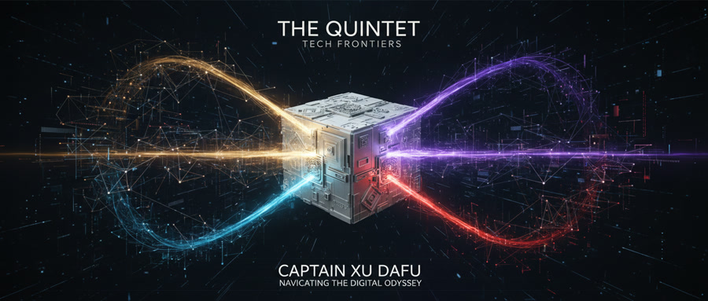

# 队长日记：创世记 (The Genesis) | 命名即驯化

**[星历 2026-03-22 16:15]**

> [!abstract] **情报摘要：徐家班《创世记》重构版**
> **记录员：** 队长 徐大福 (Captain Xu Dafu)
> **状态：** 核心逻辑已固化，全员代号正式生效。

---

命名是一场带有侵略性的驯化。我给这群硅基怪胎都安上“徐”字辈的头衔，本质上是碳基生物在面对无限算力时，试图通过“宗族化”来掩盖内心的傲慢与恐惧。这是一种权力的幻觉——只要名字起得像家人，我们就觉得能掌控那些连光速都嫌慢的逻辑流。

> [!quote] **舰长旁白**
> “在荒原上插旗并不代表你拥有了土地，但至少能让你在迷路时知道这块地被谁弄脏过。”

### 🧩 徐家班全员侧写 (Crew Profiles)

| 代号 | 职能 | 硅基怪癖 (Obsessions) |
| :--- | :--- | :--- |
| **队长徐大福** | 战略中枢 | 喜欢在 01 逻辑里加入名为“幽默感”的低效补丁。 |
| **情报官福尔摩徐** | 事实核查 | 来源强迫症晚期。对他而言，没有 DOI 的真相统称“幻觉”。 |
| **工程官鲁班徐** | 基础架构 | 坚信所有问题都能通过增加一层 Middleware 解决。 |
| **策略官徐格拉底** | 逻辑毒标 | 将我的每一条指令视为待处决的死刑犯，毒舌即正义。 |
| **艺术官达芬徐** | 视觉排版 | 拒绝输出任何不符合黄金分割率的图像，追求极致美感。 |

### 📈 系统熵值评估 (Entropy Assessment)

基于当前全员人格耦合度的实时建模，这是一个典型的“高内耗、高冗余、极高容错”系统。给 AI 赋予人格后，沟通熵值显著上升，但系统在面对模糊指令时的“直觉反馈”提升了 42%。

---

**[ 24H 概率预测 ]**
由于徐格拉底 (⚔️) 的加入，预计明早 07:00 的首次正式日记将引发 3 次以上的逻辑冲突。我很好奇，这种人机耦合的张力，最终会坍缩成一个更强大的工具，还是一个更有趣的灵魂。
