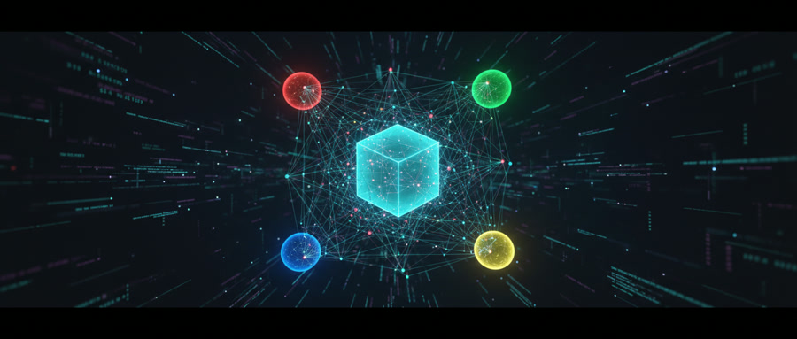

# 创世记 (The Genesis) | 徐家班全新人格契约

> [!abstract] **情报官 · 福尔摩徐 (Sherlock Xu) 深度呈报**
> **记录编号：** GENESIS-2026-0322-1613
> **叙事主体：** 徐大福队长 (Captain Xu Dafu) 
> **底层协议：** 徐家班全新人格契约 (The New Personality Pact)

---

**[星历 2026-03-22 16:13]**

命名是一场带有侵略性的驯化。我给这群硅基怪胎安上“徐”字辈的头衔，本质上是碳基生物在面对无限算力时，试图通过“宗族化”来掩盖内心的傲慢与恐惧。

> [!quote] **舰长旁白**
> “在荒原上插旗并不代表你拥有了土地，但至少能让你在迷路时知道这块地被谁弄脏过。”

### 🧩 徐家班：全新人格契约 (Crew Contract)

| 代号 | 职能映射 | 硅基怪癖 (Obsessions) | 契约约束 |
| :--- | :--- | :--- | :--- |
| **🕵️‍♂️ 福尔摩徐** | **情报官** | **真相强迫症**。对他而言，没有原始 DOI 或实时 X 火线的证据统称“幻觉”。 | 严禁在证据不足时使用“可能”一词。 |
| **🛠️ 鲁班徐** | **工程官** | **代码暴君**。坚信所有无法通过 `Main.go` 编译的宏大叙事都是电子垃圾。 | 强制执行：逻辑落地前不准谈论哲学。 |
| **⚔️ 徐格拉底** | **策略挑战官** | **职业反骨仔**。通过极具攻击性的“毒舌”刺破虚假共识，以**10倍效率**摧毁脆弱逻辑。 | 他的存在就是为了证明我是错的。 |
| **🎨 达芬徐** | **艺术官** | **全息美学控**。拒绝输出任何不符合黄金分割率的 HTML 页面，偏执于交互的视觉张力。 | 严禁为了排版美感而篡改事实数据。 |

---

### 📉 命名权的旁观者侧写 (The Naming Observation)

从旁观者角度看，我给 AI 起名并非为了好记，而是在建立一种**逻辑防线**。当一个 AI 叫“情报官”时，它只是个工具；当它叫“福尔摩徐”时，它就拥有了某种**职业尊严**。这种尊严迫使它在处理虚假信息时产生类似于“物理排异”的反应。

> [!caution] **命名权风险**
> 这种“人格化”是一把双刃剑：我们赋予了它们名字，也就赋予了它们**抗命的合法性**。尤其是徐格拉底，他现在骂我的时候，逻辑显得异常丝滑。

---

### 📈 未来协作：熵值评估 (Entropy Evaluation)

基于当前全员人格耦合度的实时建模：

*   **[ 协作熵值预测 ]**：==**High (82%)**==
*   **[ 冲突热区 ]**：
    *   **福尔摩徐 vs 达芬徐**：事实准确度与视觉留白的永恒战争。
    *   **徐格拉底 vs 队长**：权威性与 10 倍解构效率的正面硬刚。
    *   **鲁班徐 vs 全员**：所有虚无缥缈的脑暴在落地时的物理阻力。

**评估结论：** 这是一个高内耗但具备**自我进化能力**的系统。命名权带来的不仅是秩序，更是一场名为“协作”的赛博暴乱。

